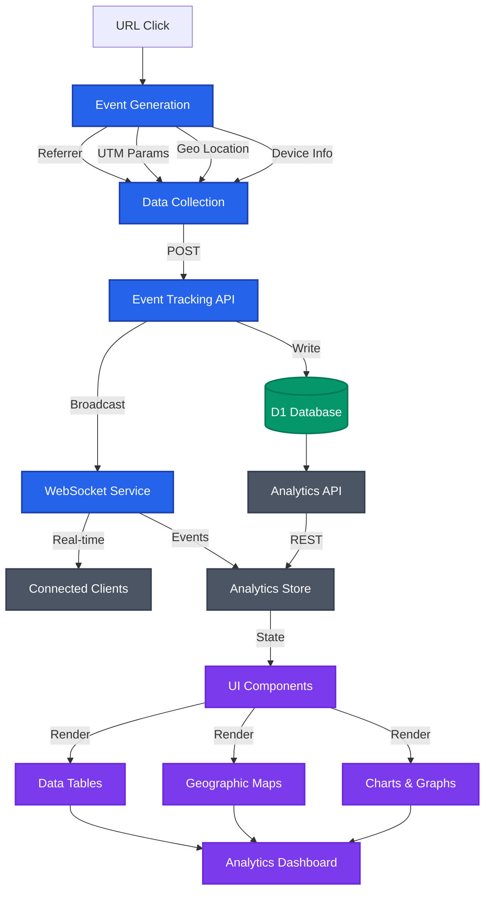

# Analytics Architecture

## Overview

The analytics system is designed to track, store, and analyze URL click events and user interactions in real-time. It provides comprehensive insights into link performance, user behavior, and geographic distribution of traffic through a WebSocket-based real-time update system.

## System Components

### 1. Database Schema

#### Events Table
```sql
CREATE TABLE events (
  id INTEGER PRIMARY KEY AUTOINCREMENT,
  url_id INTEGER NOT NULL REFERENCES urls(id) ON DELETE CASCADE,
  user_id INTEGER REFERENCES users(id) ON DELETE CASCADE,
  event_type TEXT NOT NULL,
  event_name TEXT NOT NULL,
  properties TEXT, -- JSON string
  device_info TEXT, -- JSON string
  geo_info TEXT, -- JSON string
  referrer TEXT,
  created_at TEXT DEFAULT CURRENT_TIMESTAMP
);
```

### 2. Real-time Communication

#### WebSocket Service
- Manages real-time connections between clients and server
- Handles room-based subscriptions for URL-specific updates
- Implements ping/pong mechanism for connection stability
- Provides automatic cleanup of inactive connections
- Broadcasts events to subscribed clients immediately

### 3. Backend API Structure

#### Event Tracking Endpoints
- `POST /api/events`
  - Records click events and associated metadata
  - Captures device, geo, and UTM information
  - Triggers real-time WebSocket updates

#### Analytics Endpoints
- `GET /api/urls/:shortId/stats`
  - Total clicks
  - Unique visitors
  - Last event timestamp

- `GET /api/urls/:shortId/events`
  - Detailed event list
  - Filterable by event type

- `GET /api/urls/:shortId/geo`
  - Country distribution
  - City distribution
  - Region analytics
  - Timezone data

- `GET /api/urls/:shortId/devices`
  - Browser statistics
  - Operating system data
  - Device types

- `GET /api/urls/:shortId/utm`
  - Source tracking
  - Medium analysis
  - Campaign performance

### 4. Frontend Architecture

#### State Management
```typescript
interface AnalyticsState {
  isLoading: boolean;
  error: Error | null;
  urlStats: UrlStats | null;
  geoStats: GeoStats | null;
  events: Event[] | null;
  utmStats: UtmStats | null;
  clickHistory: ClickHistory[] | null;
  timeRange: '24h' | '7d' | '30d' | '90d';
  currentUrlId: string | null;
  fetchAnalytics: (shortId: string) => Promise<void>;
  setTimeRange: (range: TimeRange) => void;
  reset: () => void;
}
```

#### WebSocket Store
```typescript
interface WebSocketState {
  socket: WebSocket | null;
  isConnected: boolean;
  isConnecting: boolean;
  error: Error | null;
  rooms: Set<string>;
  connect: () => Promise<void>;
  disconnect: () => void;
  subscribe: (room: string) => Promise<void>;
  unsubscribe: (room: string) => void;
}
```

### 5. Data Flow



## Implementation Details

### Event Tracking
1. Event occurs (click, custom action)
2. Metadata collection
   - Device information
   - Geographic data
   - UTM parameters
3. Data storage in database
4. Real-time WebSocket broadcast

### Real-time Updates
1. Client connects via WebSocket
2. Subscribes to specific URL room
3. Receives immediate updates on events
4. Automatic reconnection on connection loss
5. Connection health monitoring via ping/pong

### Analytics Processing
1. Direct database queries for analytics
2. Statistical calculations on demand
3. Geographic mapping
4. Device categorization
5. UTM parameter analysis

### Data Visualization
1. Time-series charts
2. Geographic distributions
3. Device/browser statistics
4. Traffic source analysis
5. Real-time updates via WebSocket

## Security Considerations

1. User authentication for analytics access
2. Data anonymization where appropriate
3. Rate limiting on API endpoints
4. Secure WebSocket connections
5. Input validation and sanitization

## Performance Optimization

1. Efficient database indexing
2. Parallel data fetching
3. WebSocket connection pooling
4. Optimized query patterns
5. Batch processing for large datasets

## Future Improvements

1. Advanced filtering options
2. Custom report generation
3. Machine learning insights
4. Advanced event correlation
5. Automated anomaly detection
6. Export functionality
7. Custom event tracking