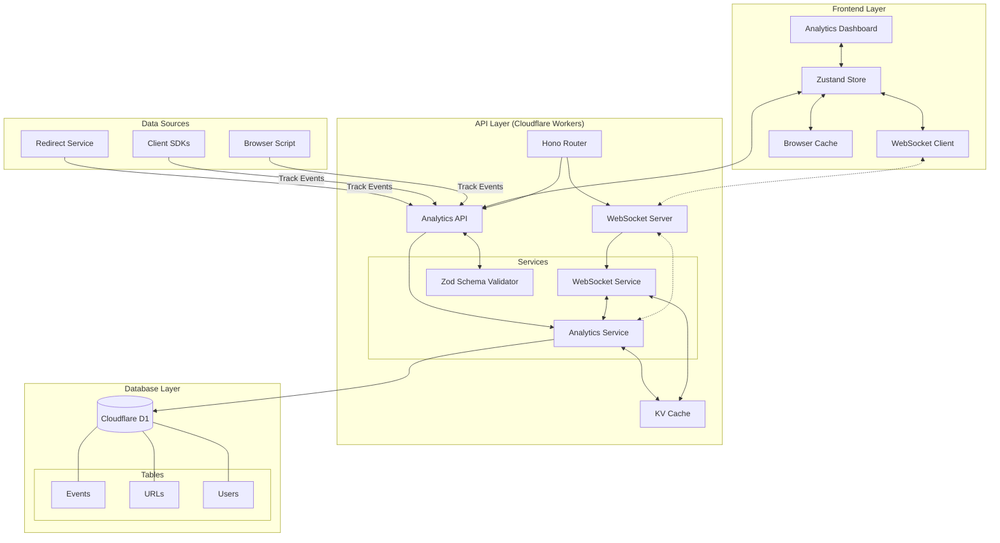
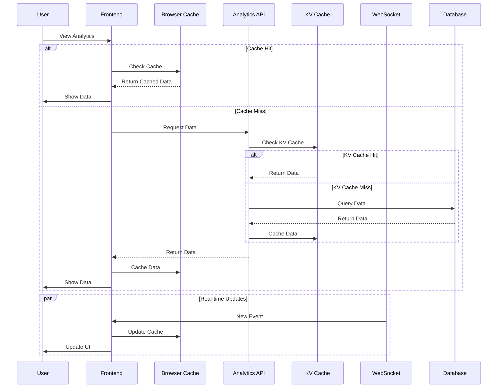
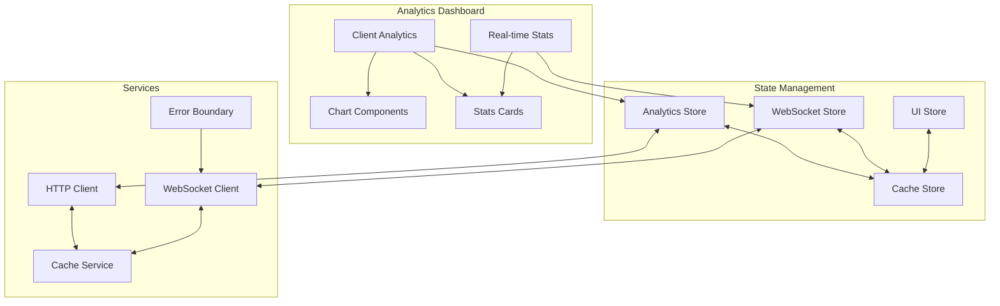
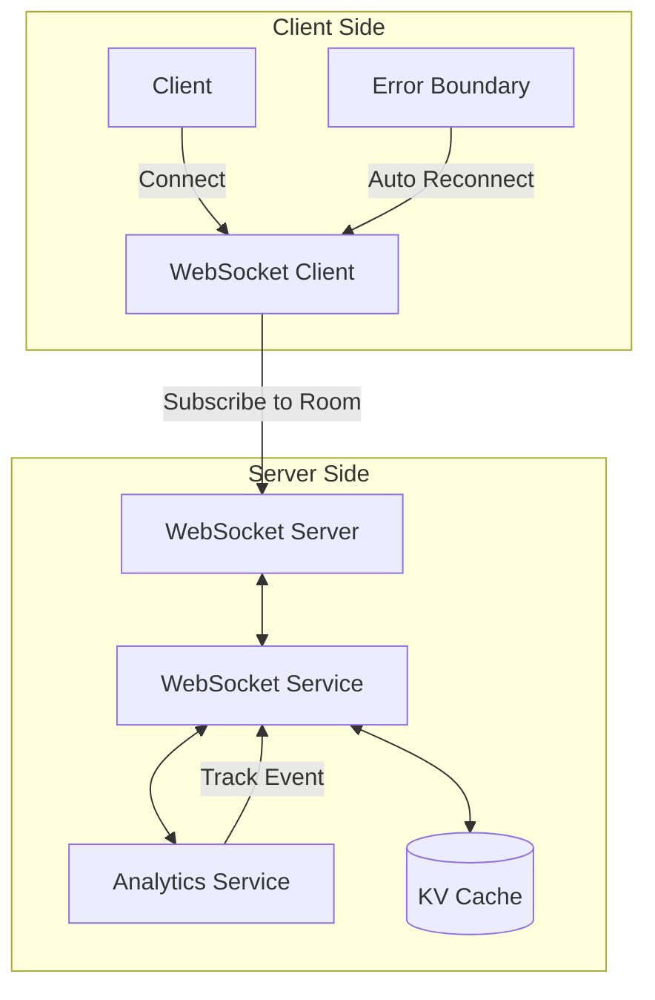

# Chop URL One Link Analytics System

## Overview

Chop URL provides comprehensive analytics through a combination of real-time WebSocket updates and REST APIs. The system tracks various event types, collects detailed metrics, and offers both URL-specific and user-level analytics.

## System Architecture

### High-Level Overview


### Data Flow



### Component Structure



## Core Features

### 1. Event Tracking
- Multiple event types:
  - `REDIRECT`: URL redirection events
  - `PAGE_VIEW`: Page view tracking
  - `CLICK`: Click events
  - `CONVERSION`: Conversion tracking
  - `CUSTOM`: User-defined custom events

### 2. Data Collection

#### Device Information
```typescript
interface DeviceInfo {
  userAgent: string;
  ip: string;
  browser: string;
  browserVersion: string;
  os: string;
  osVersion: string;
  deviceType: 'desktop' | 'mobile' | 'tablet' | 'unknown';
}
```

#### Geographic Data
```typescript
interface GeoInfo {
  country: string;
  city: string;
  region: string;
  regionCode: string;
  timezone: string;
  longitude: string;
  latitude: string;
  postalCode: string;
}
```

#### UTM Parameters
```typescript
interface EventProperties {
  source: string | null;
  medium: string | null;
  campaign: string | null;
  term: string | null;
  content: string | null;
  shortId: string;
  originalUrl: string;
}
```

### 3. Real-time Updates

#### WebSocket Architecture


#### Connection Management
- Room-based subscriptions (`url:{shortId}`)
- Automatic reconnection
- Connection state tracking
- Error recovery

### 4. Data Storage

#### Database Schema
- Events table
  - Core event data
  - JSON-serialized properties (UTM, custom data)
  - Device and geo info
  - Timestamps
  - User and URL references
- URLs table
  - Short URL data
  - Creation info
  - User reference
- Users table
  - User information
  - Authentication data
  - Preferences

### 5. Analytics Features

#### URL Analytics
- Total clicks and unique visitors
- Click history with time ranges
- Geographic distribution
- Device and browser stats
- UTM parameter tracking
- Real-time updates

#### User Analytics
- Aggregated stats across all URLs
- Custom event tracking
- Time-based filtering
- Detailed breakdowns

### 6. Frontend Implementation

#### State Management
- Zustand stores:
  - Analytics state
  - WebSocket state
  - UI state
- Real-time sync
- Optimistic updates

#### UI Components
- Real-time counters
- Time series charts
- Distribution visualizations
- Loading states
- Error boundaries

### 7. API Endpoints

#### Analytics Routes
- `POST /events`: Track new events
- `POST /custom-events`: Create custom events
- `GET /events/:urlId`: Get URL events
- `GET /custom-events/:userId`: Get user's custom events
- `GET /urls/:shortId/stats`: Get URL statistics
- `GET /urls/:shortId/events`: Get filtered events
- `GET /urls/:shortId/geo`: Get geographic stats
- `GET /urls/:shortId/devices`: Get device stats
- `GET /user/analytics`: Get user dashboard stats

### 8. Error Handling

#### Backend
- Custom error classes
- Input validation with Zod
- Database error handling
- Graceful degradation

#### Frontend
- Error boundaries
- Loading states
- Retry mechanisms
- User feedback

## Future Improvements

### Planned Features
- Advanced filtering and search
- Custom dashboards
- Export functionality
- Enhanced visualizations
- Real-time alerts