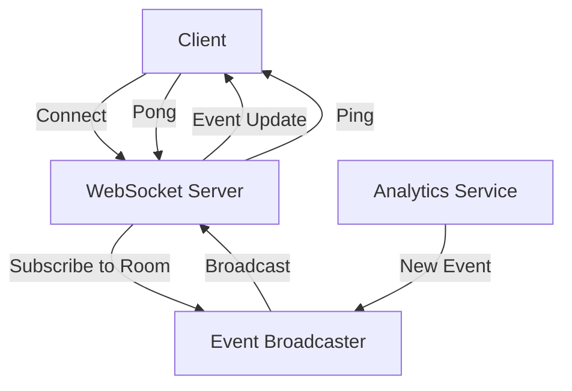

# Analytics Architecture

## Overview
Chop URL's analytics system provides real-time and historical data through a combination of WebSocket connections and REST APIs. The system is designed to be scalable, reliable, and provide instant feedback to users.

## Architecture Components

### 1. Data Collection
- Event tracking via API endpoints
- Real-time click tracking
- Device and browser information
- Geographic data collection
- UTM parameter tracking

### 2. Real-time Updates
#### WebSocket System


#### Connection States
- **Connected**
  - Active WebSocket connection
  - Real-time updates flowing
  - Visual: Green status with Wifi icon
  - Smooth scale-in animation

- **Disconnected/Retry**
  - Connection lost or unstable
  - Automatic reconnection attempts
  - Visual: Yellow status with WifiOff icon
  - Maximum 5 retry attempts
  - Exponential backoff (1s, 2s, 4s, 8s, 16s)

- **Failed**
  - Maximum retries exceeded
  - Manual reconnection required
  - Visual: Red status with WifiOff icon
  - Semi-transparent icon state

### 3. Data Storage
- Primary: Cloudflare D1 Database
- Real-time: WebSocket event broadcasting
- Cache: Cloudflare KV for frequently accessed data

### 4. Analytics Dashboard
#### Real-time Stats Component
```typescript
interface RealTimeStats {
  totalEvents: number
  uniqueVisitors: number
  lastEventAt: string | null
  connectionStatus: 'connected' | 'disconnected' | 'failed'
  retryCount: number
}
```

#### Data Visualization
- Click history charts
- Geographic distribution
- Device statistics
- UTM source tracking

### 5. Error Handling
- Connection error recovery
- Data synchronization
- Fallback to cached data
- Clear error messaging

## Implementation Details

### 1. WebSocket Connection Management
```typescript
// Connection setup
const setupWebSocket = async () => {
  try {
    await connect();
    await subscribe(`url:${urlId}`);
    await fetchAnalytics(urlId);
  } catch (error) {
    handleReconnection();
  }
};

// Reconnection logic
const handleReconnection = () => {
  if (retryCount < MAX_RETRIES) {
    setTimeout(setupWebSocket, getBackoffDelay(retryCount));
  }
};
```

### 2. State Management
```typescript
interface AnalyticsState {
  urlStats: UrlStats | null
  isLoading: boolean
  isConnected: boolean
  retryCount: number
  lastPongTime: number | null
}
```

### 3. Visual Feedback
```typescript
const getStatusColor = () => {
  if (isConnected) return 'bg-green-100 text-green-800'
  if (retryCount >= MAX_RETRIES) return 'bg-red-100 text-red-800'
  return 'bg-yellow-100 text-yellow-800'
}
```

## Performance Considerations

### 1. Connection Optimization
- Efficient message serialization
- Minimal payload size
- Automatic cleanup of inactive connections
- Resource management

### 2. Data Efficiency
- Incremental updates
- Cached responses
- Batched operations
- Optimized queries

### 3. Error Recovery
- Automatic reconnection
- Data synchronization
- Cached fallbacks
- Clear user feedback

## Security Measures

### 1. Connection Security
- Secure WebSocket (WSS)
- Authentication tokens
- Room-based access control
- Connection timeouts

### 2. Data Protection
- Input validation
- Rate limiting
- Data sanitization
- Access controls

## Monitoring and Maintenance

### 1. Health Checks
- Connection status monitoring
- Performance metrics
- Error tracking
- Usage statistics

### 2. Debugging
- Detailed error logging
- Connection state tracking
- Performance profiling
- User feedback collection

## Future Improvements

### 1. Planned Enhancements
- GraphQL subscriptions
- Enhanced caching strategies
- Advanced data aggregation
- Custom event tracking

### 2. Scalability
- Horizontal scaling
- Load balancing
- Data sharding
- Performance optimization