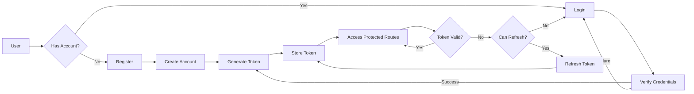
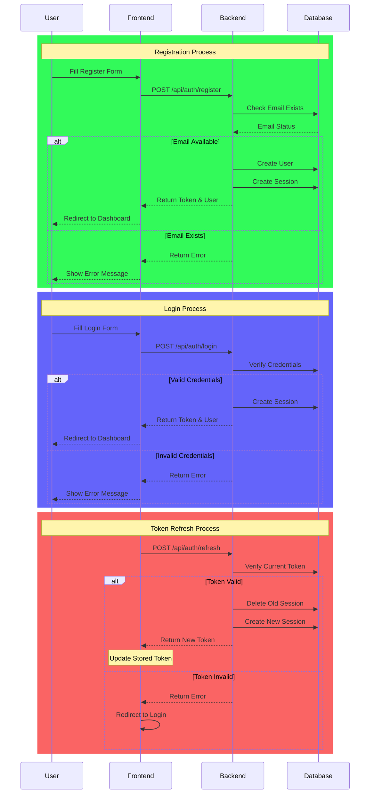
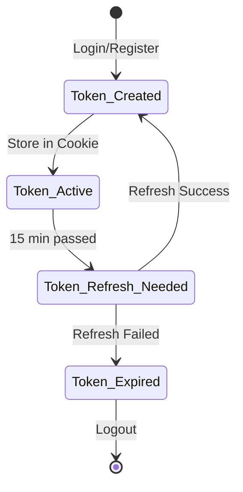
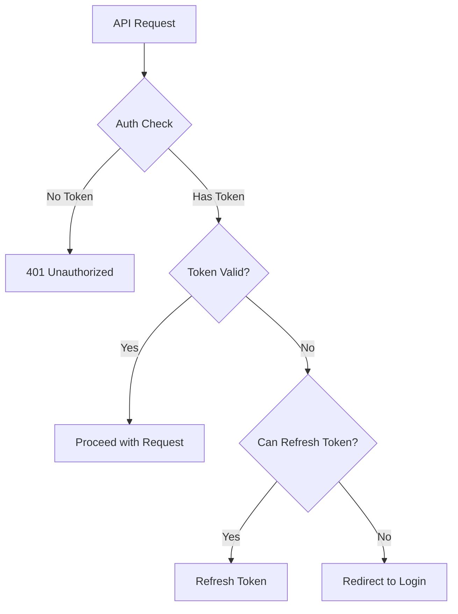

# Authentication & Authorization

This documentation provides a detailed explanation of the authentication and authorization system in the Chop URL application.

## Table of Contents
1. [Overview](#overview)
2. [Auth Flow](#auth-flow)
3. [Token Management](#token-management)
4. [API Endpoints](#api-endpoints)
5. [Security Measures](#security-measures)

## Overview

Chop URL uses a JWT-based authentication system. User sessions are managed with HTTP-only cookies, and a unique token is generated for each session.

### Key Features
- JWT-based authentication
- HTTP-only cookie token management
- Automatic token refresh (every 15 minutes)
- Session-based management
- CORS protection

## Auth Flow

### High-Level Overview



### Detailed Flow



The authentication flow is divided into three main processes:

1. **Registration Process** (Green)
   - User fills registration form
   - Backend validates email uniqueness
   - Creates new user if email is available
   - Generates and returns session token

2. **Login Process** (Blue)
   - User provides credentials
   - Backend verifies credentials
   - Creates new session on success
   - Returns error on invalid credentials

3. **Token Refresh Process** (Red)
   - Frontend requests token refresh
   - Backend validates current token
   - Creates new session if valid
   - Forces re-login if invalid

Each process includes error handling and appropriate user feedback. The system maintains security by:
- Validating credentials at each step
- Managing sessions in the database
- Automatically refreshing tokens
- Handling edge cases (invalid credentials, expired tokens)

## Token Management

### Token Lifecycle


### Timing

```mermaid
gantt
    title Token Refresh Cycle
    dateFormat HH:mm
    axisFormat %H:%M

    section Token 1
    Active           :t1, 00:00, 15m
    Refresh Window   :t1r, after t1, 5m
    
    section Token 2
    Active           :t2, after t1r, 15m
    Refresh Window   :t2r, after t2, 5m
```


## API Endpoints

| Endpoint | Method | Auth Required | Description |
|----------|--------|---------------|-------------|
| `/api/auth/register` | POST | No | Create new user account |
| `/api/auth/login` | POST | No | User login |
| `/api/auth/logout` | POST | Yes | User logout |
| `/api/auth/refresh` | POST | Yes | Refresh token |
| `/api/auth/me` | GET | Yes | Get current user info |

### Request/Response Examples

#### Register
```typescript
// Request
POST /api/auth/register
{
  "email": "user@example.com",
  "password": "password123"
}

// Response
{
  "user": {
    "id": 1,
    "email": "user@example.com",
    "created_at": "2024-02-07T10:00:00Z",
    "updated_at": "2024-02-07T10:00:00Z"
  },
  "token": "jwt_token_here",
  "expiresAt": "2024-02-07T11:00:00Z"
}
```

## Security Measures

1. **Token Security**
   - HTTP-only cookies
   - Secure flag (in production)
   - SameSite=strict
   - 1-hour expiration time

2. **CORS Protection**
   ```typescript
   cors({
     origin: ['http://localhost:3000', 'https://app.chop-url.com'],
     credentials: true,
     allowHeaders: ['Content-Type', 'Authorization'],
     maxAge: 86400,
   })
   ```

3. **Password Security**
   - Minimum 8 characters
   - SHA-256 hashing
   - Salt implementation

## User Stories

### User Registration
```gherkin
Feature: User Registration
  
  Scenario: Successful Registration
    Given User is on registration form
    When Email and password are entered
    Then New account is created
    And User is redirected to Dashboard
    And Token is stored in cookie

  Scenario: Invalid Email
    Given User is on registration form
    When Invalid email is entered
    Then Error message is displayed
    And Form is not reset
```

### Token Refresh
```gherkin
Feature: Token Refresh

  Scenario: Automatic Refresh
    Given User is logged in
    When Token has been active for 15 minutes
    Then It is automatically refreshed
    And User continues seamlessly

  Scenario: Refresh Failure
    Given Token cannot be refreshed
    When Refresh attempt fails
    Then User is logged out
    And Redirected to login page
```

## Error Handling



## Frontend Implementation

### Using Auth Context
```typescript
function MyComponent() {
  const { user, login, logout } = useAuth();

  if (!user) {
    return <LoginForm onSubmit={login} />;
  }

  return (
    <div>
      <h1>Welcome, {user.email}</h1>
      <button onClick={logout}>Logout</button>
    </div>
  );
}
```

### Token Refresh Mechanism
```typescript
useEffect(() => {
  const refreshInterval = setInterval(async () => {
    try {
      const result = await refreshToken();
      if (!result) {
        await logout();
      }
    } catch (error) {
      await logout();
    }
  }, 15 * 60 * 1000);

  return () => clearInterval(refreshInterval);
}, []);
```

## Common Issues and Solutions

### CORS Issues
```typescript
// Problem: Credentials not being sent
axios.create({
  withCredentials: true,  // Required for cookies
  headers: {
    'Content-Type': 'application/json'
  }
});

// Problem: CORS preflight failing
app.use(cors({
  origin: true,
  credentials: true,
  methods: ['GET', 'POST', 'PUT', 'DELETE', 'OPTIONS']
}));
```

### Token Refresh Edge Cases
1. **Race Conditions**
   ```typescript
   let refreshPromise: Promise<any> | null = null;

   async function refreshToken() {
     if (refreshPromise) return refreshPromise;
     
     refreshPromise = api.post('/auth/refresh');
     try {
       return await refreshPromise;
     } finally {
       refreshPromise = null;
     }
   }
   ```

2. **Multiple Tabs**
   ```typescript
   window.addEventListener('storage', (event) => {
     if (event.key === 'auth_token' && !event.newValue) {
       // Token was removed in another tab
       window.location.href = '/login';
     }
   });
   ```

## Testing Guide

### Unit Tests
```typescript
describe('Auth Provider', () => {
  it('should handle successful login', async () => {
    const { result } = renderHook(() => useAuth());
    
    await act(async () => {
      await result.current.login('test@example.com', 'password');
    });
    
    expect(result.current.user).toBeDefined();
    expect(Cookies.get('auth_token')).toBeDefined();
  });
});
```

### Integration Tests
```typescript
describe('Auth Flow', () => {
  it('should maintain session across page reloads', async () => {
    // Login
    await page.type('input[name="email"]', 'test@example.com');
    await page.type('input[name="password"]', 'password');
    await page.click('button[type="submit"]');
    
    // Verify redirect
    expect(page.url()).toContain('/dashboard');
    
    // Reload and verify session persists
    await page.reload();
    expect(page.url()).toContain('/dashboard');
  });
});
``` 