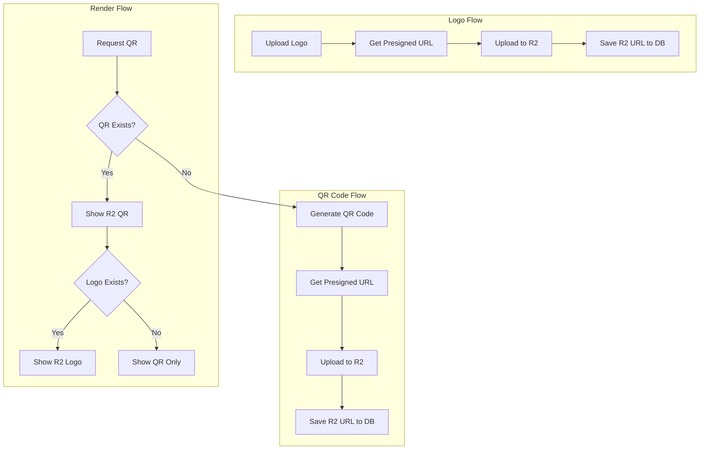

# QR Code R2 Migration Documentation

## Current Database Structure

The `qr_codes` table currently has the following relevant fields:
- `image_url`: Stores the QR code as base64 or URL
- `logo_url`: Stores the logo as base64 or URL

## Migration Flow Diagram

## Process Flows

### 1. QR Code Generation Flow
- Frontend generates QR code using qrcode.react
- Backend provides presigned URL for R2 upload
- QR code is uploaded to R2
- R2 URL is saved to database

### 2. Logo Upload Flow
- User uploads logo
- Backend provides presigned URL for R2 upload
- Logo is uploaded to R2
- R2 URL is saved to database

### 3. QR Code Rendering Flow
- QR code details are requested
- If QR exists, display from R2
- If no QR exists, generate new one
- If logo exists, display from R2

## Implementation Requirements

### Backend Changes
1. Presigned URL Endpoints
   - Create endpoint for QR code upload
   - Create endpoint for logo upload
   - Handle R2 bucket configuration

2. R2 Upload Services
   - QR code upload service
   - Logo upload service
   - File type validation
   - Size limitations

3. Database Service Updates
   - Update QR code URL storage
   - Update logo URL storage
   - Migration for existing records

### Frontend Changes
1. QR Generation Logic
   - Generate QR code
   - Handle R2 upload
   - Update UI for upload status

2. Logo Upload Logic
   - File selection
   - R2 upload
   - Progress indication

3. Display Logic
   - Render QR from R2 URL
   - Render logo from R2 URL
   - Handle loading states
   - Error handling

## Security Considerations
- Validate file types
- Implement file size limits
- Secure presigned URLs
- Handle expired URLs
- Implement proper error handling

## Performance Considerations
- Optimize file sizes
- Cache R2 responses
- Handle concurrent uploads
- Implement retry mechanisms

## Migration Strategy
1. Create new R2 endpoints
2. Update frontend to use R2
3. Migrate existing base64 data
4. Cleanup old base64 data 